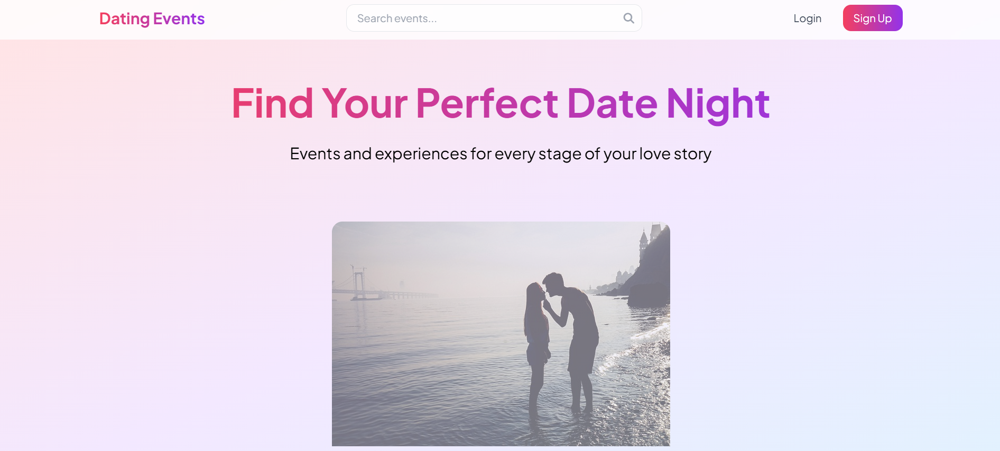
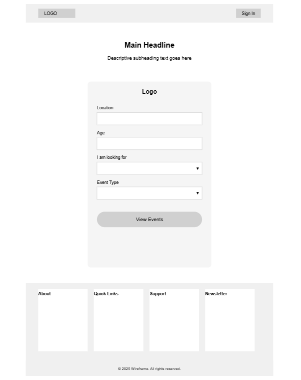
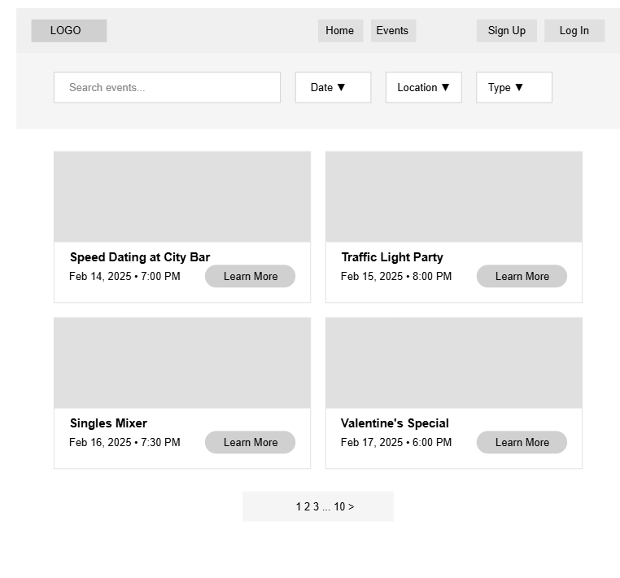
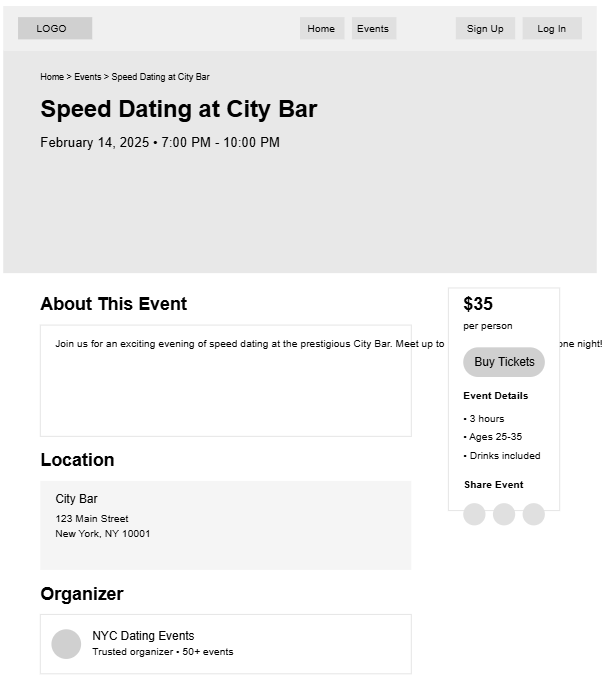
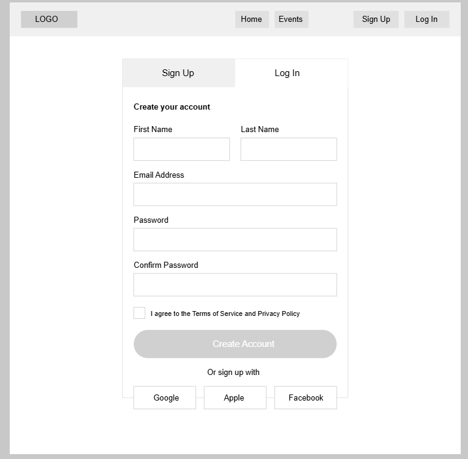

# Love.exe - February Hackathon 2025

The site can be accessed [here](https://dating-events-app-512687071453.herokuapp.com/). 

## Goal
Build a dating app with a focus on connections and inclusivity

## Judging Criteria
### Innovation/Creativity (is the app unique in comparison to others alrady out there?)
- We believe that our app is unique as it includes all kinds of couple. If you're married and looking for a date night or simply looking for a friend to walk your dog with, you can find it at 'Dating Events'.
### UI/UX (is the app intuitive, visually appealing and easy to navigate?)
- We love the look and feel of our site. The soft tones and intuitive design make finding your perfect date night easy! 
### Functionality (does the app function as intended?)
- Manual testing was carried out throughtout the build of the site and bugs fixed as they were found. The site can be accessed [here](https://dating-events-app-512687071453.herokuapp.com/) for you to enjoy!
### Social impact (does the app address critical issues like inclusivity, safety or accessibility?)
- Here at Dating Events, it doesn't matter who are you or who you love, you're welcome here. With a moderation system amdeasy to navigate filters including LGBTQA+ and neurodiversity, we want Dating Events to be a safe space for everyone. 
### Documentation (is the project well planned out?)
- Continue reading to find out! 

## Problem Statement
People spend a lot of time online and aren't sure where to go to seek connection. Ctrl+Alt+Date wants to take people out of the online world and allow them to interact in real life - singles seeking singles; dating or married couples; platonic relationships - find your place at Dating Events.

## UX
### User stories
- As a user, when I go on the website it should be clear what the website is about and its purpose, so that that I know whether to I want to view the website or not.
- As a user, I should be able to register for an account, so I am able to sign in and book events that I want to go to.
- As a user, I should be able to log in to the app so I am able to register and book for events to go to.
- As a user, I should be able to view a range of events in different categories on the website so I know which area of the website to visit.
- As a user, I should be able to search for events via a filter, so I can view events most suitable for me.
- As a user, events I have booked should be added to my profile, so I can see events that I have already booked.
- As a user, I expect the app to be responsive on a range of devices, so I am able to view the app on differeent devices.
- As an admin, I should be able to create, read, edit, and delete events so I can keep the platform updated with the most relevant events.

### Design
#### Colour scheme
- Soft colours in a pink/purple hue were used as these colours tend to be associated with love and relationships. A gradient was used to be remniscient of existing social media which would feel familiar to users and therefore inspire trust. 
- Clear contrasting colours were used for font for accessibility and visibility.
- 
- 
#### Typography
- Sans serif fonts are considered to be the clearest fonts to read by those with additional support needs such as dyslexia and autism therefore only sans serif fonts were considered for accessibility reasons. 
- Jakarta was chosen for it's crisp and clean feel which fit in with the vibe of the site whilst still being easy to read. 

### WireFrames
#### Home Page

#### Events Filter Page

#### Simple Events list page

#### Events Details

#### Login Page

This project is a dating events app where you can select events around the uk to book and join. 

## Features

## Deployment
- The website was deployed to Heroku and can be found [here](https://dating-events-app-512687071453.herokuapp.com/).
Heroku
- Heroku is a cloud platform that lets developers create, deploy, monitor and manage apps.
- You will need a Heroku log-in to be able to deploy a website to Heroku.
- Once you have logged into Heroku:
- Click 'New' > 'Create new app'
- Choose a unique name, choose your region and press 'Create app'
- Click on 'Settings' and then 'Reveal Config Vars'
- Add a key of 'DISABLE_COLLECTSTATIC' with a value of '1'.
- Add a key of 'DATABASE_URL' - the value will be the URL you were emailed when creating your database.
- Add a key of 'SECRET_KEY' - the value will be any random secret key (google 'secret key generator' and use it to generate a random string of numbers, letters and characters)
- In your terminal, type the code you will need to install project requirements:
pip3 install gunicorn~=20.1
pip3 install -r requirements.txt
pip3 freeze --local > requirements.txt
- Create an 'env.py' file at the root directory which contains the following:
import os
os.environ["DATABASE_URL"]='CI database URL'
os.environ["SECRET_KEY"]=" Your secret key"
- Create a file at the root directory called Procfile. In this file enter: "web: gunicorn my_project.wsgi" (without the quotes)
- In settings.py, set DEBUG to False.
- YOU SHOULD ALWAYS SET DEBUG TO FALSE BEFORE DEPLOYING FOR SECURITY
- Add ",'.herokuapp.com' " (without the double quotes) to the ALLOWED_HOSTS list in settings.py
- Add, commit and push your code.
- Go back to Heroku, click on the 'Deploy' tab.
- Connect your project to GitHub.
- Scroll to the bottom and click 'Deploy Branch' and your project will be deployed!

# Technologies used
- HTML
- CSS
- Tailwind CSS
- Javascript
- Python
- Django

## Credits
- CoPilot within VSCode
- ChatGPT
- Leonardo AI
- 

## Ctrl+Alt+Date: our team!
- Hannah Olbrich (Scrum Master/Front-end) [GitHub](https://github.com/hannahro15) [LinkedIn](https://www.linkedin.com/in/hannaholbrich/)
- Anthony Nelson (Front-end) [GitHub](https://github.com/anthonyjn08) [LinkedIn](https://www.linkedin.com/in/anthony-nelson8/)
- Dènes Kálnoky (Back-end) [GitHub](https://github.com/DFCMK) [LinkedIn](https://www.linkedin.com/in/denes-kalnoky-2306a1346/)
- Emma Lamont (Documentation/Presentation) [GitHub](https://github.com/elamont174) [LinkedIn](https://www.linkedin.com/in/emma-lamont/)
- Finnbarr Ambrose (Content/Front-end) [GitHub](https://github.com/FinnbarrAmbrose) [LinkedIn](https://www.linkedin.com/in/finnbarr-ambrose-5682221b4/)
- Kieran Chambers (Front-end) [GitHub](https://github.com/klchambers) [LinkedIn](https://www.linkedin.com/in/kieranchamberskc/)
- Lochlann O'Higgins Theilmann (Design/Front-end) [GitHub](https://github.com/Lochy2000) [LinkedIn](https://www.linkedin.com/in/lochlann-ohiggins-developer/)
